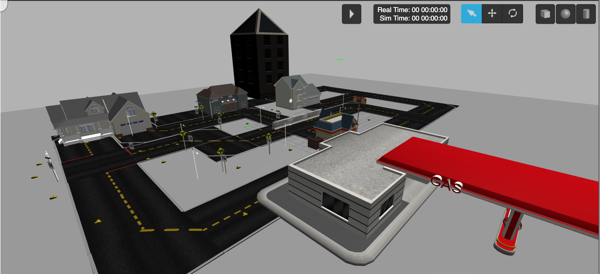

# DuckieTown Robot

## Overview and Goal

This project utilizes the Duckietown platform to develop a lane-following autonomous robot using reinforcement learning. Specifically, it employs the Q-learning algorithm, a popular reinforcement learning approach, for navigating a Duckiebot through a Duckietown environment. The project is designed for educational and research applications, providing a scalable platform for understanding complex tasks in perception, decision-making, and autonomous control.

---

### Simulation and Robot

#### Gazebo Environment
The Gazebo simulation environment includes:
- A 3D representation of Duckietown with roads, traffic lights, and various objects.
- An interface for controlling the Duckiebot through predefined actions like "Turn Left," "Turn Right," and "Forward."


#### Duckiebot Robot
The Duckiebot is a custom-built robot equipped with:
- **Camera**: Used for lane detection.
- **Motors**: Controlled via an H-bridge motor controller.
- **Raspberry Pi**: Runs the Q-learning algorithm and communicates with the sensors and actuators.


<p align="center">
  
  
</p>

---

## Usage

### - Setup

1. Clone the repository:
   ```bash
   git clone <repository_url>
   ```
2. Install the required dependencies:
   ```bash
   sudo apt update
   sudo apt install ros-noetic-desktop-full gazebo python3-opencv python3-numpy
   ```
3. Source the ROS environment and build the workspace:
  ```bash
   source /opt/ros/noetic/setup.bash
   catkin_make
   source devel/setup.bash
   ```
### - Running the Project
1. Launch the simulation with one mobile robot:
   ```bash
   roslaunch duckietown_gazebo main.launch
   ```
2. Run the Q-learning training module:
   ```bash
   roslaunch lane_following start_training.launch #this run start_qlearn_lane_follow.py for tranning the agent which saved A dedicated checkpoint file.
   ```

   
---

### Acknowledgments
This project is based on resources and tools from Duckietown and the educational platform The Construct, where we developed and tested the Duckiebot's Q-learning functionality in simulation. Special thanks to [The Construct](https://app.theconstruct.ai) for providing a comprehensive learning environment.
